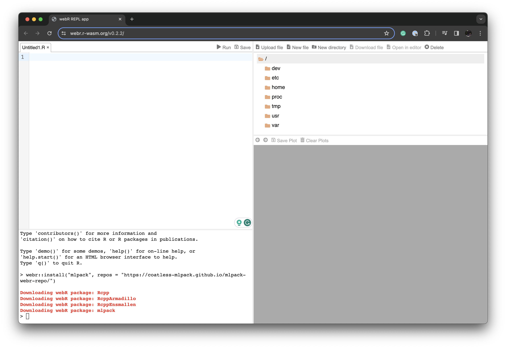

# webR Version of mlpack R Bindings

Custom repository containing the {mlpack} R bindings compiled to webR/R WASM

## Usage

In webR, install the `mlpack` package by using:

```r
webr::install("mlpack", repos = "https://coatless-mlpack.github.io/mlpack-webr-repo/")
```

For best results, we suggest running the script in the [webR REPL Editor pinned to v0.2.2 of webR](https://webr.r-wasm.org/v0.2.2/).



## Example

You can find an example script that fits a linear regression and computes predictions with MLPACK and R's routines here: [test-mlpack-webr-r-bindings.R](test-mlpack-webr-r-bindings.R).

## Structure of the repo

The custom repository holds the `{mlpack}` R bindings alongside the dependencies (`{RcppEnsmallen}`, `{RcppArmadillo}`, and `{Rcpp}`).

The files included are as follows:
```sh
$ tree
.
├── bin
│   └── emscripten
│       └── contrib
│           └── 4.3
│               ├── PACKAGES
│               ├── PACKAGES.gz
│               ├── PACKAGES.rds
│               ├── RcppArmadillo_0.12.6.6.1.data
│               ├── RcppArmadillo_0.12.6.6.1.js.metadata
│               ├── RcppArmadillo_0.12.6.6.1.tgz
│               ├── RcppEnsmallen_0.2.21.0.1.data
│               ├── RcppEnsmallen_0.2.21.0.1.js.metadata
│               ├── RcppEnsmallen_0.2.21.0.1.tgz
│               ├── Rcpp_1.0.12.data
│               ├── Rcpp_1.0.12.js.metadata
│               ├── Rcpp_1.0.12.tgz
│               ├── mlpack_4.3.0.data
│               ├── mlpack_4.3.0.js.metadata
│               └── mlpack_4.3.0.tgz
└── src
    └── contrib
        ├── PACKAGES
        ├── PACKAGES.gz
        ├── PACKAGES.rds
        ├── RcppArmadillo_0.12.6.6.1.tar.gz
        ├── RcppEnsmallen_0.2.21.0.1.tar.gz
        ├── Rcpp_1.0.12.tar.gz
        └── mlpack_4.3.0_9791d57.tar.gz
```
